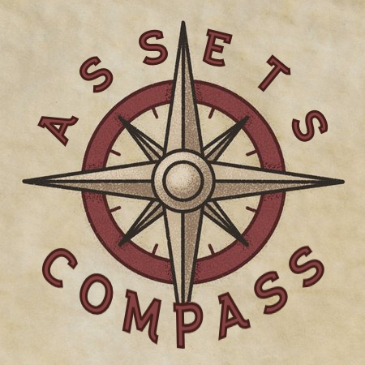

# Assets Compass

Tracker for financial data.



## Run Instructions

### Configuration

Make sure the root directory contains file named `.env` with all variables initialized:

```shell
DB_USER=<set_username>
DB_PASS=<set_password>
...
```

### Database

```shell
docker-compose up
```

### Web Application

```shell
poetry shell
uvicorn main:app --reload
```

## Usage

- By default, the application is available at port `8000`
- See autogenerated docs at `/redoc` endpoint
